# Voice Messages and Image Sending Features - Mobile App (Database Storage)

## Overview

This design document outlines the implementation of voice message recording/playback and enhanced image capture features for the Flutter chat application on mobile platforms (Android and iOS). Unlike traditional approaches, all media files will be encoded to Base64 strings and stored directly in Firestore database, eliminating dependency on Firebase Storage buckets.

### Current State
- Text messaging with end-to-end encryption is functional
- Image sending from gallery exists but uses Firebase Storage
- Message types: "text" and "image"
- `ChatService` handles Firebase Storage uploads
- `EncryptionService` provides text encryption/decryption

### Objectives
- Enable voice message recording and playback on mobile devices
- Add camera capture for direct image capture
- Encode all media (images, voice) to Base64 format
- Store encoded media directly in Firestore documents
- Decode and render media when displaying messages
- Maintain encryption consistency for sensitive content
- Optimize database storage and retrieval performance
- Handle Firestore document size limitations (1 MB per document)

## Technology Stack & Dependencies

### Required New Packages

| Package Name | Version | Purpose | Platform |
|--------------|---------|---------|----------|
| `record` | ^5.0.0 | Audio recording with native codecs | Android, iOS |
| `just_audio` | ^0.9.36 | Audio playback and streaming | Android, iOS |
| `path_provider` | ^2.1.0 | Access temporary file directories | Cross-platform |
| `flutter_sound` (Alternative) | ^9.2.13 | Comprehensive audio solution | Android, iOS |

### Existing Dependencies (Extended Usage)

| Package | Current Usage | New Usage |
|---------|---------------|-----------|
| `image_picker` | Gallery selection | Add camera capture mode |
| `permission_handler` | Video call permissions | Audio recording + camera permissions |
| `cloud_firestore` | Text/image metadata | Store Base64 encoded media |
| `crypto` | Encryption utilities | Encode/decode media files |

### Removed Dependencies

| Package | Reason |
|---------|--------|
| `firebase_storage` | No longer needed - using database storage |
| `cached_network_image` | Not applicable for Base64 images |

## Architecture

### High-Level Component Interaction

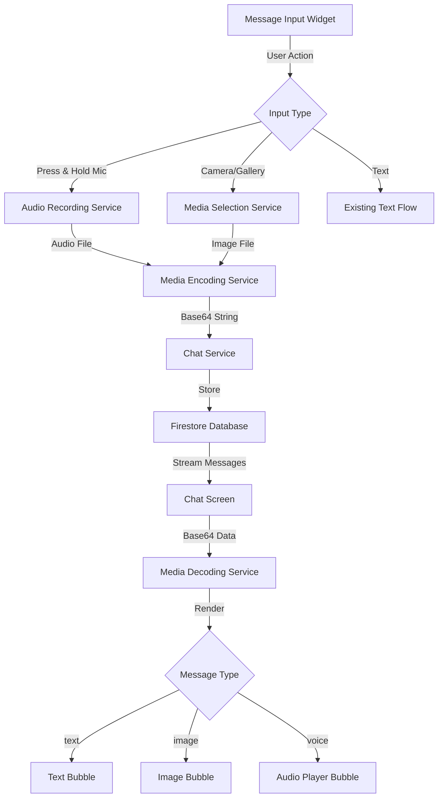

### Data Flow for Voice Messages

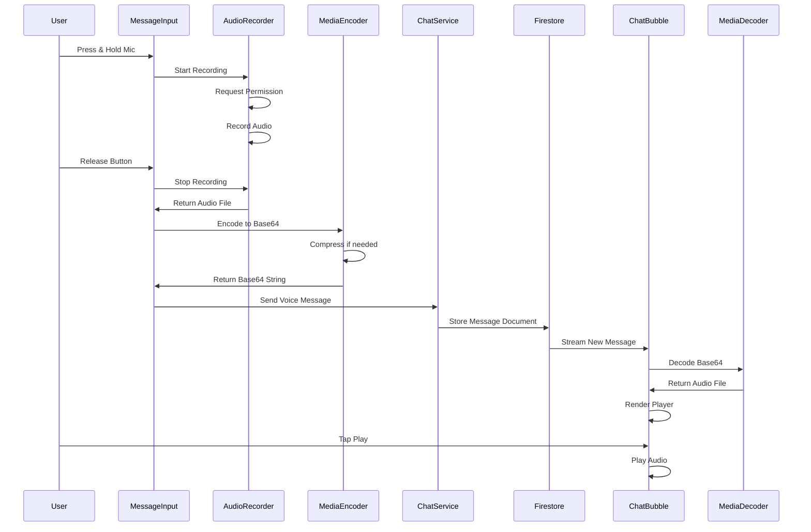

### Data Flow for Image Messages

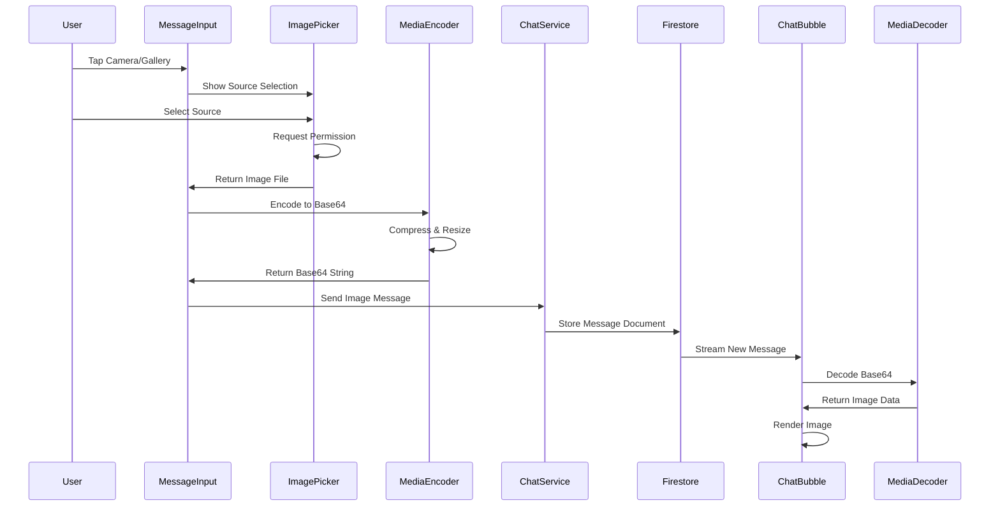

## Feature Design

### Voice Message Recording

#### User Interaction Pattern

| Action | Behavior | Visual Feedback |
|--------|----------|-----------------|
| Press & Hold Mic | Begin recording | Red pulsing mic, timer appears |
| Continue Holding | Recording in progress | Timer increments, waveform animation |
| Release Button | Stop and send | Processing indicator, then sent |
| Slide Left | Cancel recording | Recording discarded, returns to idle |
| Max Duration (60s) | Auto-stop and send | Countdown warning, auto-send |

#### Recording State Machine

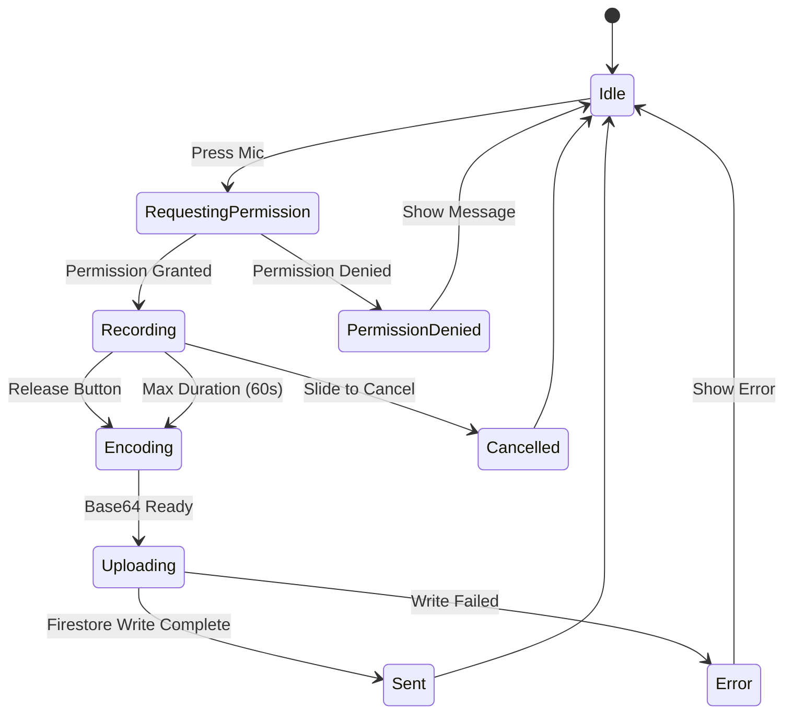

#### Audio Recording Specifications

| Parameter | Value | Rationale |
|-----------|-------|-----------|
| Format | AAC (m4a) or Opus | Best compression for voice |
| Bitrate | 32 kbps | Balance quality and size |
| Sample Rate | 16 kHz | Optimized for human voice |
| Channels | Mono | Reduces file size by 50% |
| Max Duration | 60 seconds | Firestore 1MB limit constraint |
| Target File Size | < 250 KB | Allows 4 messages per MB |

**Size Calculation:**
- 60 seconds at 32 kbps = ~240 KB raw
- Base64 encoding adds ~33% overhead = ~320 KB
- Compression can reduce to ~200-250 KB

#### Permission Handling

**Android Manifest Requirements:**
```
android.permission.RECORD_AUDIO
```

**iOS Info.plist Requirements:**
```
NSMicrophoneUsageDescription: "Record voice messages to send in chat"
```

**Permission Request Strategy:**
1. Check permission status before recording
2. Request on first mic button press
3. Show rationale if previously denied
4. Direct to app settings if permanently denied
5. Display user-friendly error messages

### Voice Message Playback

#### Audio Player UI Components

| Element | Description | Behavior |
|---------|-------------|----------|
| Play/Pause Button | ▶️ or ⏸️ icon | Toggles playback state |
| Progress Slider | Linear progress indicator | Shows position, draggable |
| Time Label | "00:15 / 00:45" | Current / total duration |
| Loading Indicator | Spinner during decode | Shows while processing Base64 |
| Waveform (Optional) | Visual amplitude representation | Static visualization |

#### Playback State Management

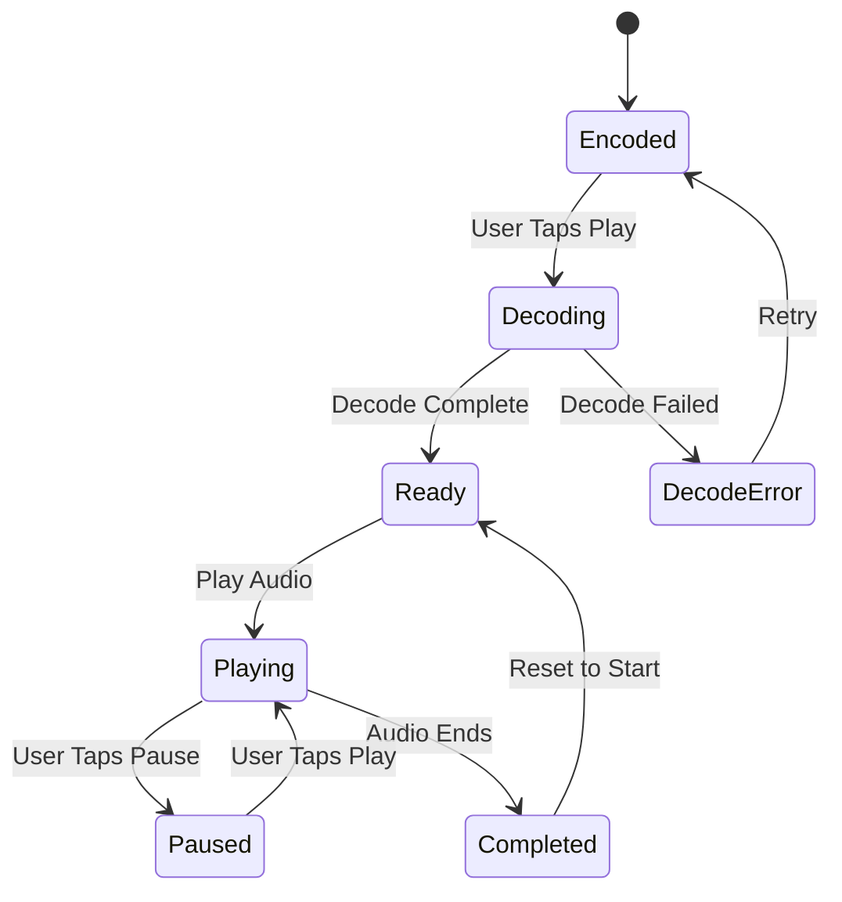

#### Audio Caching Strategy

**Challenge:** Base64 decoding is CPU-intensive

**Solution:**
- Cache decoded audio files in memory (for current chat)
- Store in temporary directory for session duration
- Clear cache when switching chats
- Re-decode only if cache miss

**Cache Implementation:**

| Strategy | Approach |
|----------|----------|
| In-Memory Cache | Map<messageId, File> for fast access |
| Disk Cache | Temporary directory using `path_provider` |
| Eviction Policy | Clear on chat exit or app background |
| Cache Size Limit | Max 10 decoded files (~2-3 MB) |

### Enhanced Image Capture & Selection

#### Image Source Options

| Source | Current | Enhancement |
|--------|---------|-------------|
| Gallery | ✓ Implemented | Maintain with Base64 encoding |
| Camera | ✗ Not Available | **Add direct camera capture** |

#### Image Selection Flow

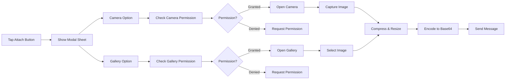

#### Image Processing Pipeline

**Optimization Requirements:**

Firestore document size limit is 1 MB, and Base64 encoding increases size by ~33%.

**Processing Steps:**

| Step | Process | Target Specification |
|------|---------|---------------------|
| 1. Capture/Select | Get original image | Any size/resolution |
| 2. Resize | Scale down dimensions | Max 800x800 px |
| 3. Compress | JPEG compression | Quality: 60-70% |
| 4. Validate Size | Check file size | Target: < 200 KB |
| 5. Re-compress | If still too large | Reduce to 50% quality |
| 6. Encode | Convert to Base64 | Final size: < 270 KB |

**Compression Algorithm:**

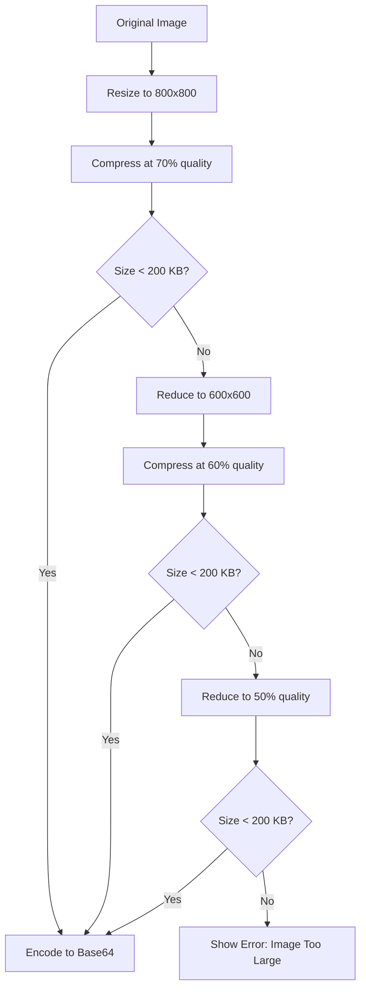

#### Camera Permission Requirements

**Android:**
```
android.permission.CAMERA
```

**iOS:**
```
NSCameraUsageDescription: "Take photos to send in chat"
NSPhotoLibraryUsageDescription: "Select photos to send in chat"
```

### Message Data Model

#### Firestore Document Structures

**Text Message (Existing):**
```
{
  senderId: string,
  receiverId: string,
  message: string (encrypted text),
  type: "text",
  timestamp: Timestamp,
  isRead: boolean
}
```

**Image Message (Modified - Base64 Storage):**
```
{
  senderId: string,
  receiverId: string,
  message: string (Base64 encoded image),
  type: "image",
  timestamp: Timestamp,
  isRead: boolean,
  imageFormat: string ("jpeg" or "png"),
  thumbnail: string (Base64 encoded small preview - optional)
}
```

**Voice Message (New - Base64 Storage):**
```
{
  senderId: string,
  receiverId: string,
  message: string (Base64 encoded audio),
  type: "voice",
  duration: number (seconds),
  timestamp: Timestamp,
  isRead: boolean,
  audioFormat: string ("m4a" or "opus"),
  waveform: array<number> (optional amplitude data)
}
```

#### Document Size Management

**Firestore Constraints:**
- Maximum document size: 1,048,576 bytes (1 MB)
- Maximum array elements: 20,000

**Strategy for Large Media:**

| Media Type | Max Encoded Size | Strategy |
|------------|------------------|----------|
| Voice (60s) | ~270 KB | Store in single document |
| Image | ~270 KB | Store in single document |
| Long Voice | > 270 KB | Split into chunks (multi-document) |
| Large Image | > 270 KB | Reject with error message |

**Chunking Strategy for Large Voice Files:**

If voice message exceeds size limit, split into chunks:

```
Message Document:
{
  type: "voice",
  isChunked: true,
  totalChunks: 3,
  duration: 90
}

Chunk Sub-collection:
  /messages/{messageId}/chunks/{chunkIndex}
  {
    data: string (Base64 chunk),
    index: number,
    size: number
  }
```

## Service Layer Architecture

### Media Encoding Service (New)

**Purpose:** Centralize all Base64 encoding/decoding operations

**Responsibilities:**
- Encode audio files to Base64 strings
- Encode image files to Base64 strings
- Decode Base64 strings to temporary files
- Compress and optimize media before encoding
- Validate encoded size against Firestore limits

**Key Methods:**

| Method | Parameters | Return Type | Purpose |
|--------|------------|-------------|---------|
| `encodeImageToBase64()` | File imageFile | Future\<String\> | Compress and encode image |
| `encodeAudioToBase64()` | File audioFile | Future\<String\> | Encode audio file |
| `decodeBase64ToImage()` | String base64, String messageId | Future\<File\> | Decode to temp image file |
| `decodeBase64ToAudio()` | String base64, String messageId | Future\<File\> | Decode to temp audio file |
| `compressImage()` | File imageFile, int quality | Future\<File\> | Compress image to target size |
| `validateSize()` | String base64 | bool | Check if within Firestore limit |
| `getMediaSize()` | String base64 | int | Calculate size in bytes |

**Encoding Implementation Details:**

**For Images:**
1. Read image file as bytes
2. Resize to max dimensions (800x800)
3. Compress with JPEG quality (70%)
4. Check size, re-compress if needed
5. Convert bytes to Base64 string
6. Validate total size < 750 KB (accounting for metadata)

**For Audio:**
1. Read audio file as bytes
2. Verify format is compressed (AAC/Opus)
3. Convert bytes to Base64 string
4. Validate total size < 750 KB
5. If too large, return error for user notification

**Decoding Implementation:**

1. Decode Base64 string to bytes
2. Get temporary directory from `path_provider`
3. Create unique filename (messageId + extension)
4. Write bytes to temporary file
5. Return file reference for playback/display
6. Cache file path for reuse

### Audio Recording Service (New)

**Purpose:** Manage audio recording lifecycle

**Responsibilities:**
- Initialize audio recorder with optimal settings
- Handle microphone permissions
- Record audio to temporary file
- Monitor recording duration
- Provide real-time recording status

**Key Methods:**

| Method | Parameters | Return Type | Purpose |
|--------|------------|-------------|---------|
| `initialize()` | None | Future\<void\> | Setup recorder instance |
| `requestPermission()` | None | Future\<bool\> | Request mic permission |
| `startRecording()` | None | Future\<void\> | Begin audio capture |
| `stopRecording()` | None | Future\<File\> | Stop and return file |
| `cancelRecording()` | None | Future\<void\> | Discard recording |
| `pauseRecording()` | None | Future\<void\> | Pause current recording |
| `resumeRecording()` | None | Future\<void\> | Resume recording |
| `getDuration()` | None | Duration | Get current length |
| `isRecording()` | None | bool | Check recording state |
| `dispose()` | None | Future\<void\> | Cleanup resources |

**Recording Configuration:**

```
AudioRecorder Configuration:
- encoder: AAC (iOS) / Opus (Android)
- bitRate: 32000
- sampleRate: 16000
- numChannels: 1 (mono)
- outputFormat: m4a (iOS) / opus (Android)
```

**State Stream:**

Emit recording events:
- `RecordingState.idle`
- `RecordingState.recording`
- `RecordingState.paused`
- `RecordingState.processing`
- `RecordingState.error`

### Media Selection Service (New)

**Purpose:** Abstract image selection and camera capture

**Responsibilities:**
- Handle camera and gallery permissions
- Open camera for image capture
- Open gallery for image selection
- Apply consistent compression
- Return processed image files

**Key Methods:**

| Method | Parameters | Return Type | Purpose |
|--------|------------|-------------|---------|
| `pickFromCamera()` | None | Future\<File?\> | Capture from camera |
| `pickFromGallery()` | None | Future\<File?\> | Select from gallery |
| `requestCameraPermission()` | None | Future\<bool\> | Request camera access |
| `requestGalleryPermission()` | None | Future\<bool\> | Request storage access |
| `showSourceDialog()` | BuildContext | Future\<ImageSource?\> | Show camera/gallery options |

**Source Selection Dialog:**

Modal bottom sheet with options:
- 📷 Camera
- 🖼️ Gallery
- ❌ Cancel

### Chat Service Extensions

**Modified Methods:**

| Method | Modification | Purpose |
|--------|--------------|---------|
| `sendImageMessage()` | Remove Firebase Storage upload<br>Add Base64 parameter | Store encoded image in Firestore |
| `sendTextMessage()` | No changes | Maintain existing encryption |

**New Methods:**

| Method | Parameters | Return Type | Purpose |
|--------|------------|-------------|---------|
| `sendVoiceMessage()` | receiverId: String<br>base64Audio: String<br>duration: int<br>format: String | Future\<void\> | Send voice message |
| `sendEncodedImage()` | receiverId: String<br>base64Image: String<br>format: String | Future\<void\> | Send Base64 image |

**Implementation Flow for Voice Message:**

1. Receive Base64 audio string from encoding service
2. Validate size is within Firestore limits
3. Create chat document (if not exists)
4. Add message document to messages sub-collection
5. Update chat metadata: `lastMessage: "[Voice Message]"`
6. Set timestamp and read status

**Implementation Flow for Image Message:**

1. Receive Base64 image string from encoding service
2. Validate size is within Firestore limits
3. Create chat document (if not exists)
4. Add message document with Base64 data
5. Update chat metadata: `lastMessage: "[Image]"`
6. Set timestamp and read status

## UI/UX Design

### Message Input Widget Modifications

#### Current Layout
```
[Emoji] [Attach] [Text Input ................] [Mic] [Send/Camera]
```

#### Enhanced Layout
```
[Emoji] [Attach ▼] [Text Input ................] [🎤 Hold] [Send]
```

**Attach Button Behavior:**

Tap → Show bottom sheet with options:
- 📷 Camera
- 🖼️ Gallery

#### Mic Button Interaction States

| State | Visual | User Action | Result |
|-------|--------|-------------|--------|
| Idle | Gray mic icon | Press & Hold | Start recording |
| Recording | Red pulsing mic | Hold | Continue recording |
| Recording | Timer + waveform | Release | Send message |
| Recording | Slide left indicator | Slide left | Cancel recording |
| Processing | Loading spinner | - | Encoding in progress |
| Disabled | Grayed out mic | - | Permission denied |

#### Recording Overlay UI

**Overlay Components:**

```
┌─────────────────────────────────┐
│   ← Slide to cancel             │
│                                 │
│   [Waveform Animation]          │
│                                 │
│   00:35 / 01:00                 │
│                                 │
│   🔴 Recording...               │
└─────────────────────────────────┘
```

**Elements:**
- Semi-transparent dark background
- Slide gesture instruction at top
- Animated waveform or pulsing circle
- Timer showing current / max duration
- Recording indicator (red dot + text)
- Warning at 50s: "10 seconds remaining"

### Chat Bubble Widget Modifications

#### Voice Message Bubble

**Sender (Right-aligned):**
```
                  ┌─────────────────────┐
                  │ 🔊 ▶️ ─────○─────   │
                  │ 00:12 / 00:45       │
                  │            12:34 ✓✓ │
                  └─────────────────────┘
```

**Receiver (Left-aligned):**
```
┌─────────────────────┐
│ ▶️ ─────○─────       │
│ 00:00 / 00:45       │
│ 12:34               │
└─────────────────────┘
```

**Component Specifications:**

| Element | Description | Behavior |
|---------|-------------|----------|
| Speaker Icon | 🔊 (only for sender) | Static visual indicator |
| Play/Pause | ▶️ or ⏸️ | Tap to toggle playback |
| Progress Bar | Draggable slider | Shows position, seekable |
| Time Display | current / total | Updates during playback |
| Status Icons | ✓ or ✓✓ (sender only) | Read receipt |

#### Image Message Bubble

**Display Strategy:**

Since images are Base64 encoded in database, not URL-based:

```
                  ┌─────────────────────┐
                  │                     │
                  │   [Decoded Image]   │
                  │   (Tap to expand)   │
                  │                     │
                  │            12:34 ✓✓ │
                  └─────────────────────┘
```

**Rendering Process:**
1. Receive Base64 string from Firestore
2. Decode to image bytes
3. Create `MemoryImage` widget
4. Display with fixed dimensions (200x200 in bubble)
5. Tap to open full-screen viewer
6. Full-screen: Decode to larger size with PhotoView

**Loading States:**

| State | Visual | Description |
|-------|--------|-------------|
| Decoding | Spinner + placeholder | Base64 decode in progress |
| Loaded | Image displayed | Successfully decoded |
| Error | Error icon | Decode failed |

### Chat Screen Integration

#### Message Type Rendering Logic

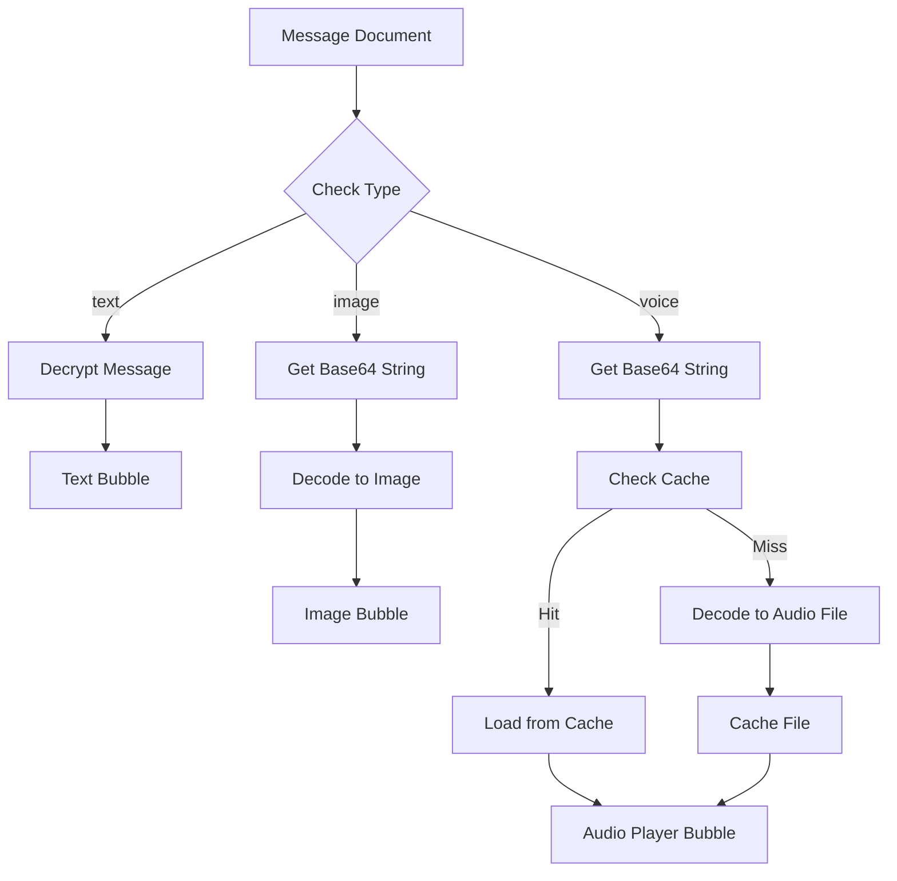

#### Decoding Performance Optimization

**Challenge:** Base64 decoding is synchronous and blocks UI

**Solutions:**

| Strategy | Implementation | Benefit |
|----------|----------------|---------|
| Isolate Processing | Use Dart Isolates for decoding | Prevents UI jank |
| Lazy Loading | Decode only visible messages | Reduces initial load time |
| Placeholder | Show placeholder during decode | Better UX |
| Caching | Cache decoded files | Avoid re-decoding |
| Pagination | Load messages in batches | Manageable memory usage |

**Isolate-Based Decoding:**

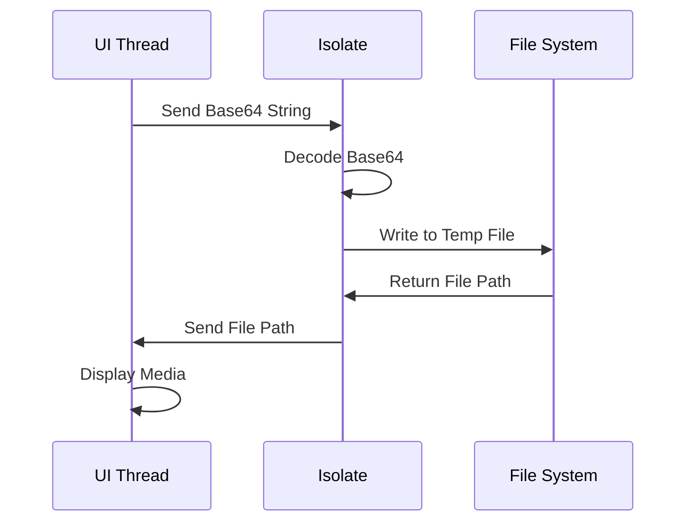

## Error Handling & Edge Cases

### Permission Errors

| Scenario | Detection | User Message | Action |
|----------|-----------|--------------|--------|
| Mic Denied | Permission check returns denied | "Microphone access is required to record voice messages" | "Open Settings" button |
| Camera Denied | Permission check returns denied | "Camera access is required to take photos" | "Open Settings" button |
| Permanently Denied | System won't show dialog | "Please enable permissions in device Settings" | Direct to app settings |

### Size Limit Errors

| Scenario | Detection | User Message | Prevention |
|----------|-----------|--------------|------------|
| Voice Too Long | Duration > 60s | "Voice message max duration is 60 seconds" | Auto-send at 60s |
| Image Too Large | Encoded size > 750 KB | "Image is too large. Try a smaller image" | Aggressive compression |
| Compression Failed | After max compression still > limit | "Unable to send this image. Size limit exceeded" | Reject with error |

### Network & Database Errors

| Error Type | Cause | User Feedback | Recovery Strategy |
|------------|-------|---------------|-------------------|
| Write Failed | Network timeout | "Failed to send message. Retry?" | Retry button |
| Read Failed | Network issue | "Cannot load messages" | Auto-retry after 3s |
| Decode Failed | Corrupted Base64 | "Message could not be loaded" | Show error placeholder |
| Permission Error | Firestore rules | "You don't have permission" | Contact support message |

### Decoding Errors

| Scenario | Cause | Handling | Fallback |
|----------|-------|----------|----------|
| Invalid Base64 | Data corruption | Log error, show placeholder | "Unable to decode" message |
| Format Mismatch | Wrong format specified | Try alternative formats | Error icon |
| Out of Memory | Large file decode | Use streaming decode | Split into chunks |
| File Write Error | Storage full | Show storage error | Prompt user to free space |

## Performance Optimization

### Database Query Optimization

**Challenge:** Large Base64 strings increase document size and query time

**Strategies:**

| Strategy | Implementation | Benefit |
|----------|----------------|---------|
| Pagination | Limit to 20 messages per query | Faster initial load |
| Lazy Loading | Load more on scroll | Reduced data transfer |
| Field Projection | Only fetch needed fields | Smaller payload |
| Indexing | Index on timestamp | Faster sorting |

**Query Example:**

```
Query Messages:
- Collection: chats/{chatId}/messages
- OrderBy: timestamp DESC
- Limit: 20
- StartAfter: lastDocumentSnapshot (for pagination)
```

### Memory Management

**Challenges:**
- Decoded media files consume memory
- Multiple simultaneous decodes can cause OOM

**Solutions:**

| Component | Strategy | Details |
|-----------|----------|---------|
| Audio Cache | LRU Cache, max 10 files | Evict oldest when limit reached |
| Image Cache | In-memory cache, max 5 MB | Clear on chat exit |
| Temporary Files | Auto-cleanup on app background | Use app cache directory |
| Isolate Pool | Reuse isolates for decoding | Max 2 concurrent isolates |

### UI Rendering Optimization

| Optimization | Technique | Impact |
|--------------|-----------|--------|
| ListView Builder | Lazy rendering | Only render visible items |
| Image Caching | Cache decoded MemoryImage | Avoid re-decode on scroll |
| Thumbnail Preview | Store small thumbnail Base64 | Faster preview load |
| Progressive Loading | Show thumbnail first, then full | Better perceived performance |

## Testing Strategy

### Unit Testing

**Media Encoding Service Tests:**

| Test Case | Input | Expected Output |
|-----------|-------|-----------------|
| Encode small image | 50 KB JPEG | Valid Base64 string < 70 KB |
| Encode large image | 5 MB JPEG | Compressed Base64 < 750 KB |
| Encode audio | 30s M4A file | Valid Base64 string < 300 KB |
| Decode valid Base64 | Valid image Base64 | Image file created |
| Decode invalid Base64 | Corrupted string | Exception thrown |
| Size validation | 800 KB Base64 | Returns false |

**Audio Recording Service Tests:**

| Test Case | Scenario | Expected Behavior |
|-----------|----------|-------------------|
| Permission granted | Mock permission = true | Recording starts |
| Permission denied | Mock permission = false | Error thrown |
| Max duration | Record for 60s | Auto-stops at 60s |
| Cancel recording | User cancels | File deleted, no send |

### Integration Testing

**End-to-End Voice Message Flow:**

1. User presses mic button
2. Permission granted
3. Records for 10 seconds
4. Releases button
5. Audio encoded to Base64
6. Message sent to Firestore
7. Receiver sees new message
8. Receiver taps play
9. Audio decoded and plays

**End-to-End Image Flow:**

1. User taps attach → camera
2. Permission granted
3. Captures image
4. Image compressed and encoded
5. Message sent to Firestore
6. Receiver sees image message
7. Image decoded and displayed
8. Taps image for full-screen view

### Performance Testing

| Metric | Target | Measurement |
|--------|--------|-------------|
| Image Encode Time | < 2 seconds | Time from file to Base64 |
| Audio Encode Time | < 1 second | Time from file to Base64 |
| Image Decode Time | < 1.5 seconds | Time from Base64 to display |
| Audio Decode Time | < 800 ms | Time from Base64 to playback |
| Message Send Time | < 3 seconds | Time from UI action to Firestore write |
| Messages Load Time | < 2 seconds | Time to load 20 messages |

## Security Considerations

### Data Encryption

**Approach:**

Currently, only text messages are encrypted. For consistency:

| Media Type | Encryption Strategy | Rationale |
|------------|---------------------|-----------|
| Voice Messages | Encrypt Base64 string | Protect voice content |
| Images | Optional encryption | Balance security vs. performance |
| Text | Existing encryption | Already implemented |

**Encryption Flow for Voice:**

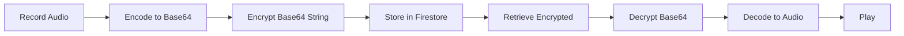

**Considerations:**
- Encrypting Base64 adds processing overhead
- Encrypted data is larger (more Firestore costs)
- Trade-off: Security vs. performance and cost

**Recommendation:**
- Voice messages: Encrypt (contains sensitive voice data)
- Images: Optional (user preference in settings)
- Provide toggle in settings: "Encrypt media messages"

### Firestore Security Rules

**Rules for Message Collection:**

```
Messages must:
- Only be created by authenticated users
- Only contain valid message types
- Have senderId matching current user
- Have required fields based on type
- Respect size limits
```

**Validation Checks:**

| Field | Validation | Rule |
|-------|------------|------|
| type | Must be "text", "image", or "voice" | Enum validation |
| senderId | Must match auth.uid | Authorization check |
| message | Base64 string, max 800KB | Size and format check |
| duration | Required if type is "voice" | Conditional validation |

### Privacy Considerations

| Concern | Mitigation | Implementation |
|---------|------------|----------------|
| Voice Data Exposure | Encrypt before storage | Use EncryptionService |
| Image Privacy | Compress to reduce detail | Automatic compression |
| Metadata Leakage | Minimal metadata storage | Only essential fields |
| Access Control | User-specific read rules | Firestore security rules |

## Migration Strategy

### Transition from Firebase Storage to Database Storage

**Current State:**
- `sendImageMessage()` uploads to Firebase Storage
- Images stored as URLs in Firestore

**Migration Steps:**

| Step | Action | Impact |
|------|--------|--------|
| 1 | Keep existing Storage-based images | Backward compatibility |
| 2 | Add new Base64 encoding service | No disruption |
| 3 | Modify `sendImageMessage()` to use Base64 | New images use database |
| 4 | Update `ChatBubble` to handle both URL and Base64 | Renders both types |
| 5 | Gradual migration (optional) | Convert old images to Base64 |

**Backward Compatibility:**

Detect message format when rendering:

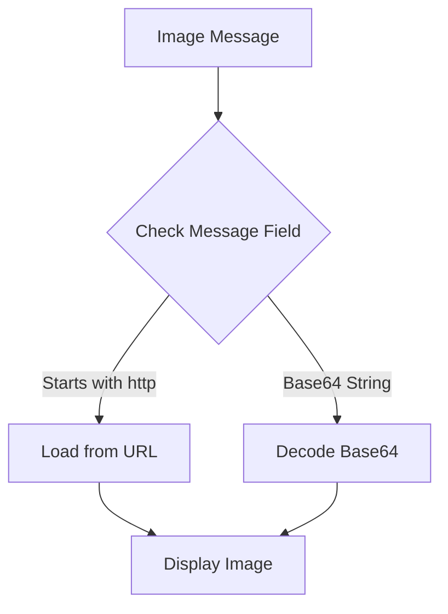

**Detection Logic:**
- If `message` starts with "http", treat as URL (legacy)
- If `message` is Base64 string, decode (new)
- Fallback: Try Base64 first, then URL

